# Wazuh Detection Engineering Lab

## Overview

This project demonstrates how to build a Detection Engineering lab using Wazuh, Sysmon, and Windows event telemetry.

The lab collects Windows endpoint logs, forwards them to a centralized Wazuh manager, and uses custom detection rules to identify potentially suspicious activity.

Custom detections were developed and mapped to MITRE ATT&CK techniques to simulate a real-world Security Operations Center (SOC) workflow.

---

## Objectives

- Deploy a Wazuh SIEM environment
- Install and configure Sysmon telemetry
- Collect Windows Security and Sysmon logs
- Create custom Wazuh detection rules
- Generate simulated attack activity
- Map detections to MITRE ATT&CK
- Perform threat hunting and alert validation

---

## Technologies Used

- Wazuh
- Sysmon
- Windows 10
- Ubuntu Server
- PowerShell
- Windows Event Logs
- MITRE ATT&CK Framework

---

## Architecture


### Data Flow

Windows Endpoint → Sysmon → Wazuh Agent → Wazuh Manager → Custom Detection Rules → Wazuh Dashboard

---

# Environment Validation

Verified communication between the Windows endpoint and Wazuh manager.

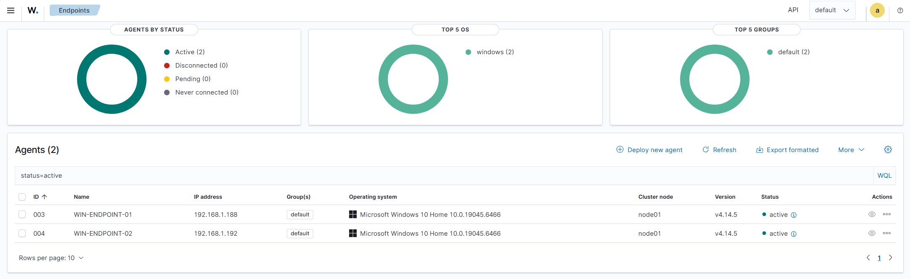

---

# Sysmon Telemetry Collection

Validated Sysmon process creation telemetry and confirmed events were successfully ingested into Wazuh.

### Sysmon Event ID 1

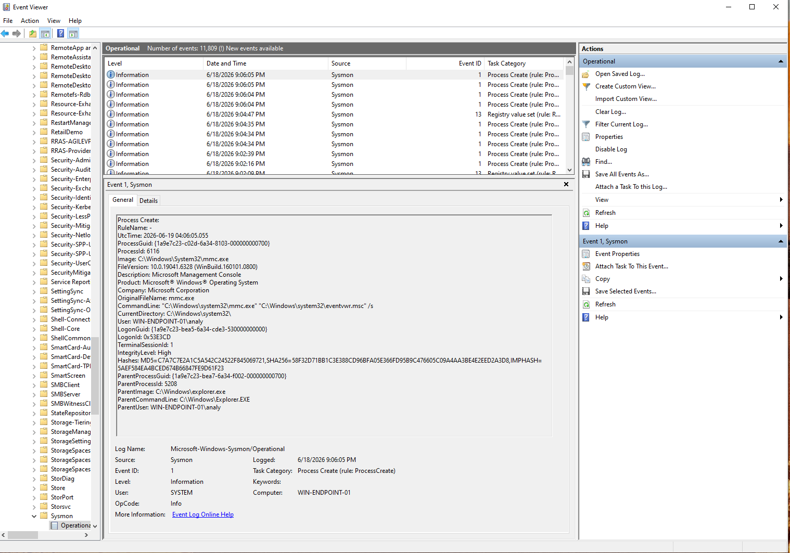

### Events Visible in Wazuh

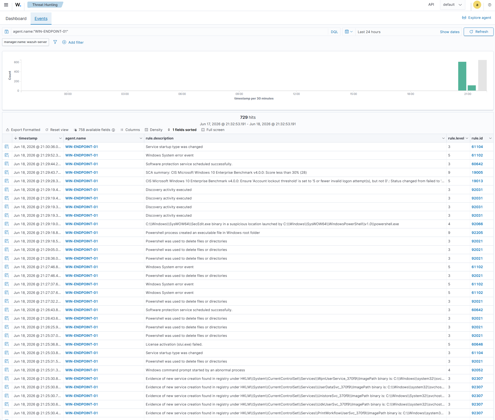

---

# Custom Detection Rule Development

Created custom Wazuh detection rules to identify suspicious activity.

### PowerShell Execution Detection

Rule ID: 100100

MITRE ATT&CK: T1059.001 – PowerShell

Detects execution of SecEdit through PowerShell.

---

# Detection 1: PowerShell Execution

Simulated PowerShell execution activity and validated custom alert generation.

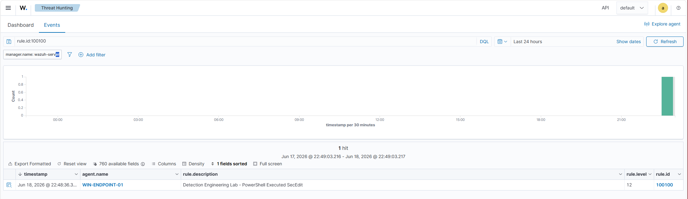

---

# Detection 2: User Account Creation

Created a new local user account and generated a custom Wazuh alert.

Rule ID: 100101

MITRE ATT&CK: T1136 – Create Account

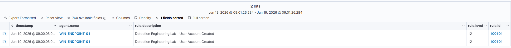

---

# Detection 3: Privilege Escalation

Added a user account to the local Administrators group and generated a custom alert.

Rule ID: 100102

MITRE ATT&CK: T1484 – Domain Policy Modification

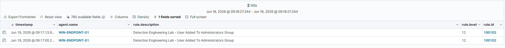

---

# Scheduled Task Activity

Created a scheduled task to simulate persistence-related activity.

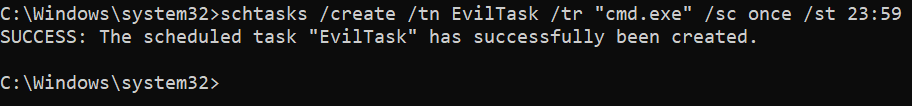

---

# Network Telemetry Analysis

Reviewed Sysmon Event ID 3 network connection telemetry generated from PowerShell activity.

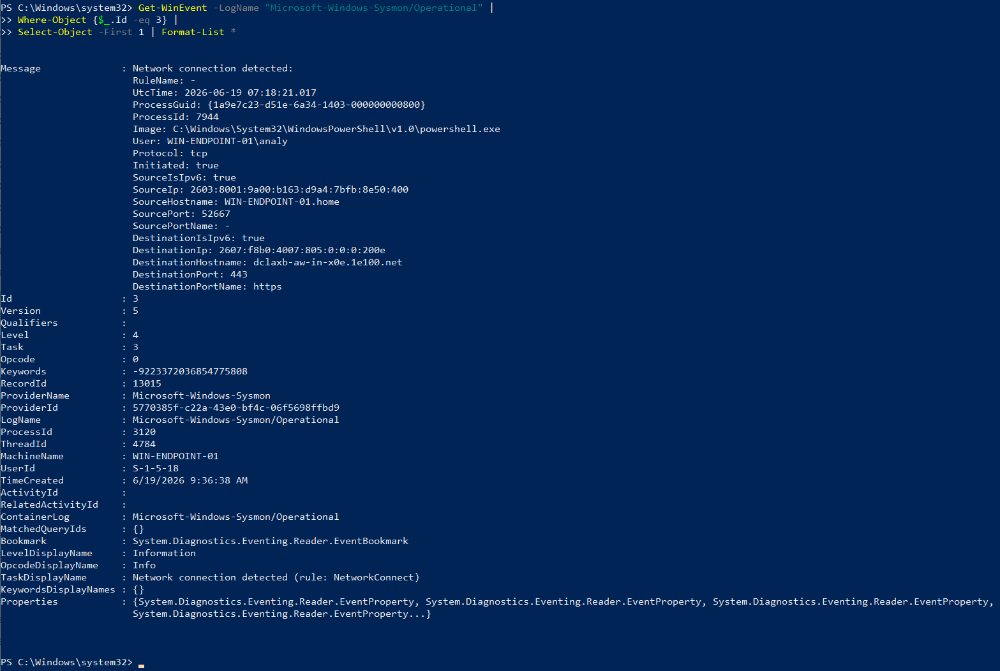

---

# MITRE ATT&CK Mapping

### PowerShell Execution

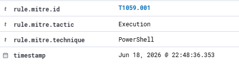

### User Account Creation

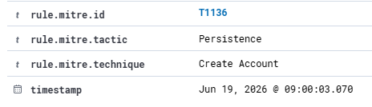

### Privilege Escalation

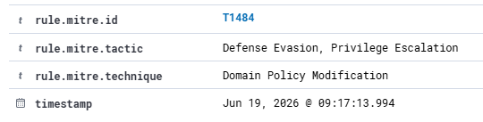

---

# Dashboard Validation

Validated all custom detections within the Wazuh dashboard.

### Custom Detection Results

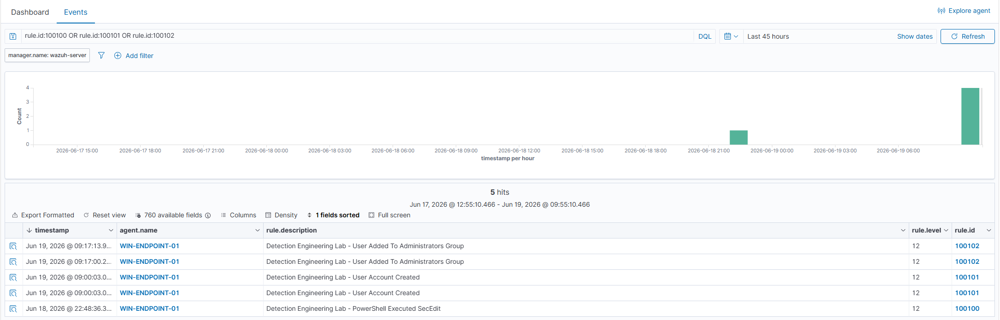

### Dashboard Overview

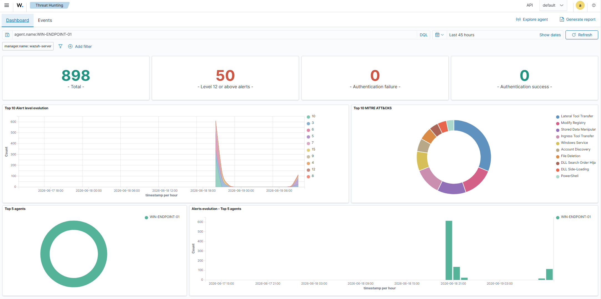

---

# Custom Rules

Location:

```
rules/custom_rules.xml
```

Implemented custom rules:

| Rule ID | Description | MITRE |
|----------|-------------|--------|
| 100100 | PowerShell Executed SecEdit | T1059.001 |
| 100101 | User Account Created | T1136 |
| 100102 | User Added To Administrators Group | T1484 |

---

# Skills Demonstrated

- Detection Engineering
- Threat Hunting
- SIEM Administration
- Wazuh
- Sysmon
- Windows Event Analysis
- Security Monitoring
- MITRE ATT&CK Mapping
- Custom Rule Development
- PowerShell Analysis

---

# Resume Highlights

- Built a Wazuh-based detection engineering lab integrating Sysmon telemetry from Windows endpoints for centralized security monitoring.

- Developed custom Wazuh detection rules identifying PowerShell execution, account creation, and administrator group membership changes mapped to MITRE ATT&CK techniques.

- Performed threat hunting and alert analysis using Windows Security Events, Sysmon logs, and custom SIEM detections to investigate simulated attack activity.